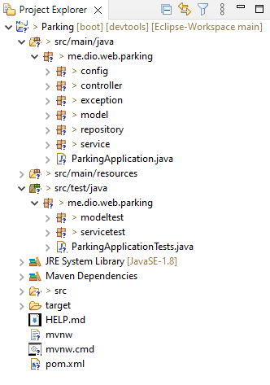
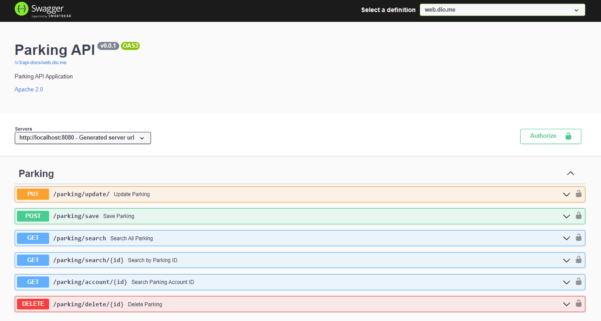

<h1><strong>Parking REST API</strong></h1>
<h2><strong>Spring Boot</strong></h2>

API developed in Java with Spring Boot to perform the parking demonstration.

<h2>API Access</h2>

<strong>User:</strong> java

<strong>Password:</strong> 123

<h5>**After tests Remove data in Delete**</h5>

<h4><a href="https://app-parking-spring-boot.herokuapp.com/swagger-ui/index.html" target="_blank">Open Parking API</a></h4>

<h2>Tools Used</h2>

Java 1.8

Spring Data JPA

Spring Web

Postgresql

JUnit Test

Open Api Ui

Dev Tools

Spring Security

<h2>Project Organization</h2>
 

<h2>Swagger</h2>
 

<h2>Author</h2>
<h4>Katarine Albuquerque</h4>

<h5>Linkedin: <a href="https://www.linkedin.com/in/katarine-albuquerque/" target="_blank">/katarine-albuquerque</a></h5>

<h5>Linkedin: <a href="https://github.com/KatarineAlbuquerque" target="_blank">/KatarineAlbuquerque</a></h5>

<h5>Linkedin: <a href="https://github.com/KatarineAlbuquerque/my-portfolio" target="_blank">/my-portfolio</a></h5>

